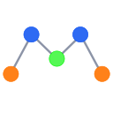

 <h1 align="center">Mole</h1>
  

    Mole provides a model for graphs, both directed and undirected.
     
    <a href="docs/Mole.md"><strong>Explore the docs »</strong></a>
     
     
    <a href="https://github.com/ba-st/Mole/issues/new?labels=Type%3A+Defect">Report a defect</a>
    |
    <a href="https://github.com/ba-st/Mole/issues/new?labels=Type%3A+Feature">Request feature</a>
  

> *Name origin*: This project started as a topological model, which can be shortened to [**Topo**](https://es.wikipedia.org/wiki/Talpidae), the Spanish word for [Mole](https://en.wikipedia.org/wiki/Mole_(animal)).

## License
- The code is licensed under [MIT](LICENSE).
- The documentation is licensed under [CC BY-SA 4.0](http://creativecommons.org/licenses/by-sa/4.0/).

## Quick Start

- Download the latest [Pharo 32](https://get.pharo.org/) or [64 bits VM](https://get.pharo.org/64/).
- Download a ready to use image from the [release page](https://github.com/ba-st/Mole/releases/latest)
- Explore the [documentation](docs/Mole.md)

## Installation

To load the project in a Pharo image, or declare it as a dependency of your own project follow this [instructions](docs/Installation.md).

## Contributing

Check the [Contribution Guidelines](CONTRIBUTING.md)
