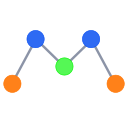

# Mole

Mole provides a model for graphs, both directed and undirected.

> *Name origin*: This project started as a topological model, which can be
> shortened to [**Topo**](https://es.wikipedia.org/wiki/Talpidae), the Spanish
> word for [Mole](https://en.wikipedia.org/wiki/Mole_(animal)).

## Quick links

- [**Explore the docs**](docs/README.md)
- [Report a defect](https://github.com/ba-st/Mole/issues/new?labels=Type%3A+Defect)
- [Request a feature](https://github.com/ba-st/Mole/issues/new?labels=Type%3A+Feature)

## License

- The code is licensed under [MIT](LICENSE).
- The documentation is licensed under [CC BY-SA 4.0](http://creativecommons.org/licenses/by-sa/4.0/).

## Installation

To load the project in a Pharo image follow this [instructions](docs/how-to/how-to-load-in-pharo.md).

## Contributing

Check the [Contribution Guidelines](CONTRIBUTING.md)
